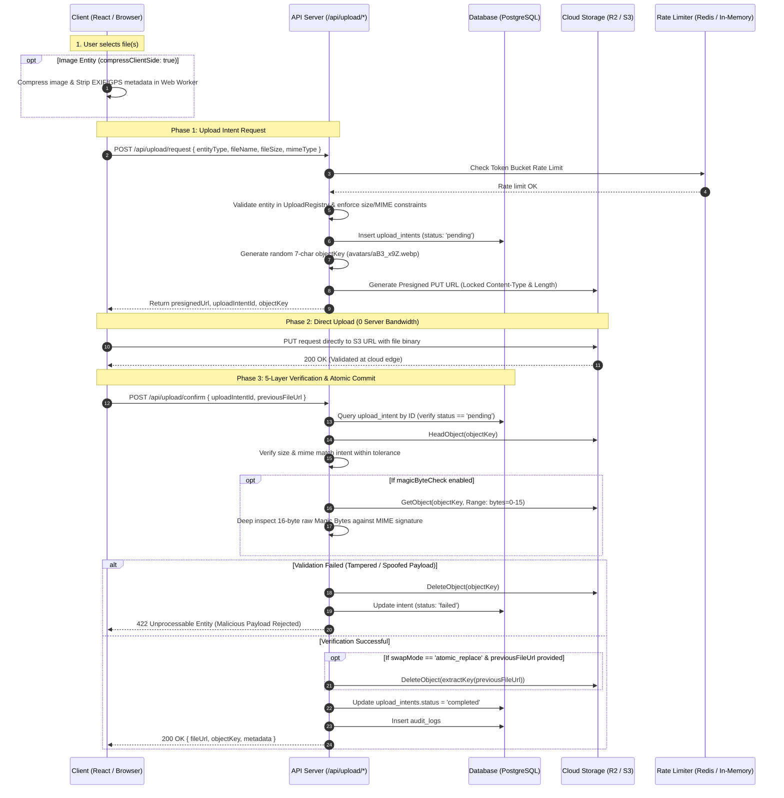

# 🛡️ Defensive Security & Threat Model: Universal Uploader

[](https://github.com/axosolaman)
[](https://github.com/axosecurity)
[]()
[]()

> **Authored by Security Researcher [axosolaman](https://github.com/axosolaman) ([Axo Security](https://github.com/axosecurity))**  
> *A technical deep-dive into file upload vulnerability mechanics, bug bounty economics, CWE mitigation mappings, and defensive cloud storage engineering.*

---

## 📑 Table of Contents
1. [The Real-World Threat Landscape & Bug Bounty Economics](#1-the-real-world-threat-landscape--bug-bounty-economics)
2. [Master CWE Vulnerability Mitigation Matrix](#2-master-cwe-vulnerability-mitigation-matrix)
3. [The Hidden Dangers of Server-Side EXIF Stripping](#3-the-hidden-dangers-of-server-side-exif-stripping)
4. [5-Layer Defense-in-Depth Pipeline Architecture](#4-5-layer-defense-in-depth-pipeline-architecture)
5. [End-to-End Sequence Diagram](#5-end-to-end-sequence-diagram)
6. [Attacker Exploit Scenarios & How Universal Uploader Neutralizes Them](#6-attacker-exploit-scenarios--how-universal-uploader-neutralizes-them)
7. [Reporting a Vulnerability](#7-reporting-a-vulnerability)
8. [Author & Security Researcher Bio](#8-author--security-researcher-bio)

---

## 1. The Real-World Threat Landscape & Bug Bounty Economics

File upload endpoints are historically the **single most lucrative attack surface** across bug bounty platforms like **HackerOne, Bugcrowd, and Intigriti**. Naive implementations (e.g. standard `multer`, basic presigned URLs without byte inspection, or file-extension-only checks) regularly lead to catastrophic breaches.

### 📊 Public Bug Bounty Data & Industry Stats
* **CWE-434 (Unrestricted Upload of Dangerous Type)**: Over **2,220+ unique disclosed reports** on HackerOne. It remains among the most actively reported critical bug classes.
* **Chained Vulnerabilities**: Path Traversal (CWE-22), Improper Input Validation (CWE-20), and Stored XSS (CWE-79) via uploads account for thousands more findings.
* **Typical Bug Bounty Payout Ranges**:
  * **Basic MIME Spoof / Extension Bypass**: $500 – $3,000
  * **Upload ➔ Stored XSS or EXIF Data Leak**: $1,000 – $5,000
  * **Upload ➔ Path Traversal / Arbitrary File Write**: $3,000 – $15,000
  * **Upload ➔ Remote Code Execution (RCE)**: **$3,000 – $30,000+ (Critical CVSS 9.0–10.0)**

---

## 2. Master CWE Vulnerability Mitigation Matrix

| CWE ID | Vulnerability Name | How Universal Uploader Neutralizes It | Severity / Impact | Bounty Payout Range |
| :--- | :--- | :--- | :--- | :--- |
| **CWE-434** | **Unrestricted Upload of File with Dangerous Type** | Strict MIME whitelist + max size limits + **16-byte binary magic byte inspection** (PNG, JPEG, PDF, WEBP, AVIF, ZIP, etc.) + post-upload `HeadObject` verification + single-use cryptographic intent tokens. | **Critical → High** (Full RCE / Server Takeover) | **$3,000 – $30,000+** |
| **CWE-646** | **Reliance on File Name or Extension of Externally-Supplied File** | Server generates an unpredictable random 7-character object key (e.g. `avatars/xK9_m2Q.webp`). **Never trusts client filenames or double extensions** (`.php.jpg`). Binary magic bytes dictate authenticity. | **High** (Webshell / Polyglot Bypass) | **$2,000 – $10,000** |
| **CWE-20** | **Improper Input Validation** | **5-layer defense-in-depth pipeline**: Client-side validation → Cryptographic presigned URL constraints → Storage metadata verification → S3 Byte-Range binary inspection → Atomic database commit. | **High** (Injection / Tampering) | **$1,000 – $5,000** |
| **CWE-22 / CWE-73** | **Path Traversal / External Control of File Path** | Strict isolated storage folders, randomized server-generated object keys, zero user-controlled file paths, and atomic replacement garbage collection. | **High → Critical** (Arbitrary File Overwrite / Config Tampering) | **$3,000 – $15,000** |
| **CWE-200 / CWE-359 / CWE-212** | **Exposure of Sensitive Information (EXIF / GPS Leakage)** | Client-side **Web Worker automatically strips all EXIF metadata and GPS coordinates** in memory *before* the upload token is even requested. | **Medium → High** (User Doxxing / Privacy Lawsuits / GDPR) | **$1,000 – $5,000** |
| **CWE-400** | **Uncontrolled Resource Consumption (DoS)** | Strict per-entity file size limits + distributed token-bucket rate limiting + **Zero Server Bandwidth (Direct-to-S3/R2 PUT)**. Web servers never buffer file blobs in RAM. | **Medium → High** (Server Crash / Wallet Draining) | **$500 – $3,000** |
| **CWE-862 / CWE-306** | **Missing Authentication / Missing Authorization** | Per-entity `requiresAuth` enforcement, intent records cryptographically bound to authenticated user sessions, and single-use confirmation state machines. | **High** (Unauthorized File Replacement) | **$1,500 – $6,000** |
| **CWE-79** | **Stored XSS via File Upload** | SVGs and HTML payloads are sanitized and rejected unless explicitly permitted in isolated sandboxed entity configurations. | **Medium → High** (Session Hijacking / Account Takeover) | **$1,000 – $5,000** |

---

## 3. The Hidden Dangers of Server-Side EXIF Stripping

Many backend engineers attempt to sanitize image metadata on the server using CLI utilities like `ExifTool`, `ImageMagick`, or native C-bindings. **From an offensive security perspective, server-side EXIF processing introduces severe critical attack vectors:**

### ⚠️ Vulnerabilities Created by Server-Side EXIF Processing

| Risk Type | Description & Real-World Exploits | Severity |
| :--- | :--- | :--- |
| **Command Injection / RCE** | Backend servers invoke binaries (`ExifTool`, `ImageMagick`, `ffmpeg`) on untrusted files. Crafted metadata payloads, filename pipes, or parser format bugs execute arbitrary OS commands. <br>• **CVE-2021-22204** (ExifTool DjVu parser) ➔ Led directly to **CVE-2021-22205 (GitLab unauthenticated pre-auth RCE)**.<br>• Multiple ExifTool command injections via `DateTimeOriginal` and parameter pipe injection. | **Critical (CVSS 9.8–10.0)** |
| **Parser & Memory Corruption** | C/C++ image parsing libraries have a decades-long history of buffer overflows, integer underflows, and out-of-bounds memory writes when unpacking corrupted EXIF chunks. <br>• Real-world vulnerabilities in `libexif`, `ImageMagick`, `OpenImageIO`, and `FFmpeg` metadata decoders. | **High → Critical** |
| **SSRF / Arbitrary File Read** | Legacy image processors parse indirect metadata delegates (e.g. SVG internal XML entities or MSL scripts), forcing the backend server to make internal network requests or dump local `/etc/passwd` files. <br>• Classic **ImageTragick** (CVE-2016-3714) and modern policy-bypass variants. | **High** |
| **Denial of Service (DoS)** | Malformed EXIF headers (such as circular tags or decompression bombs) trigger infinite loops, 100% CPU thread starvation, or multi-gigabyte memory allocations (**CWE-770, CWE-400**). | **Medium → High** |
| **Privacy Leak During Transit** | When EXIF stripping is done on the server, the raw unstripped file (containing high-precision GPS coordinates, user home location, device IDs) is transmitted across the wire and written to temporary server disks or logs before being processed. | **Medium → High (GDPR Breach)** |
| **Incomplete Stripping / Polyglot Survival** | Basic server-side strip commands often strip only standard EXIF IFDs while preserving comments, IPTC, XMP, or embedded PHAR/PHP polyglot blocks inside auxiliary segments. | **Medium → High** |

### 🏆 Why Client-Side Web Worker Stripping Wins

| Architectural Dimension | Client-Side Web Worker (Universal Uploader) | Traditional Server-Side Processing |
| :--- | :--- | :--- |
| **Server Attack Surface** | **Zero** — Server never executes metadata parsing binaries | **Massive** — Server must execute complex C/Perl binaries |
| **RCE Vulnerability Risk** | **None** — Browser sandbox isolates processing | **High** (History of ExifTool / ImageMagick CVEs) |
| **User GPS & Privacy** | **100% Protected** — Stripped before leaving browser | **Exposed** — Transits wire & lands in server temp storage |
| **Server CPU & Memory Load** | **Zero Overhead** — Client device performs resizing | **High** — Heavy server CPU spikes and RAM consumption |
| **Bypass Resilience** | Bypassing client still triggers server-side magic byte locks | Attacker only needs to craft 1 weaponized metadata exploit |

---

## 4. 5-Layer Defense-in-Depth Pipeline Architecture

```
[ User File ] 
      │
      ▼  Layer 1: Pre-flight Client Validation & Web Worker Processing
   • Resizes image, strips EXIF (GPS/camera metadata), compresses file in Web Worker
   • Checks MIME whitelist and size limits before network transmission
      │
      ▼  Layer 2: Cryptographic Presigned PUT URL Token Issuance
   • Token-bucket rate limiting check (Redis / In-memory)
   • Issues 60s short-lived Presigned PUT URL locked strictly to Content-Type & Length
   • Generates unpredictable random 7-char cache-busting key (folder/aB3_x9Z.ext)
   • Creates database upload intent record with status: "pending"
      │
      ▼  [ Direct Browser-to-Cloud PUT — 0 Server Bandwidth Consumed ]
      │
      ▼  Layer 3: Post-Upload Storage HeadObject Verification
   • Server queries S3 HeadObject metadata to confirm actual byte length & Content-Type
   • Verifies uploaded size matches intent within strict tolerance (fileSizeTolerance: 0.10)
      │
      ▼  Layer 4: 16-Byte Magic Byte Binary Signature Inspection
   • Fetches only first 16 bytes via S3 byte-range request (Range: bytes=0-15)
   • Validates raw mathematical signatures (PNG: 89 50 4E 47, PDF: 25 50 44 46, JPEG: FF D8 FF, etc.)
   • INSTANT PURGE: If spoofed or malicious, instantly deletes object from S3 and marks intent failed
      │
      ▼  Layer 5: Single-Use State Machine & Atomic Replacement
   • Updates intent to "completed" with audit logging
   • If swapMode == "atomic_replace", safely deletes old avatar/document from storage
   • Emits finalized secure public CDN URL
```

---

## 5. End-to-End Sequence Diagram



---

## 6. Attacker Exploit Scenarios & How Universal Uploader Neutralizes Them

### Scenario A: The Polyglot Webshell Bypass
* **Attacker Strategy**: Attacker renames `shell.php` to `shell.php.png` or injects PHP code into image comments, expecting the backend or web server to execute it.
* **Universal Uploader Defense**:
  1. The server generates an unpredictable random key (`avatars/9xK_m2Z.png`), destroying user file paths and extensions.
  2. The raw first 16 bytes are validated against `0x89 0x50 0x4E 0x47` binary signature.
  3. Files are stored on isolated Cloudflare R2 / AWS S3 storage buckets with no PHP execution engine.

### Scenario B: The Extension & MIME Spoof
* **Attacker Strategy**: Attacker intercepts HTTP request and declares `Content-Type: image/jpeg` while sending an `.exe` or `.sh` script.
* **Universal Uploader Defense**:
  1. The server performs an S3 byte-range read (`Range: bytes=0-15`) on the uploaded object.
  2. Binary signatures for JPEG (`FF D8 FF`) fail verification.
  3. The server immediately issues `DeleteObject` to storage, updates intent status to `failed`, and logs the security incident.

### Scenario C: Intent Replay & Race Conditions
* **Attacker Strategy**: Attacker attempts to reuse a valid `uploadIntentId` to confirm multiple uploads or swap another user's file.
* **Universal Uploader Defense**:
  1. Intent records are strictly bound to the authenticated `userId`.
  2. The status transition is atomic: only intents with `status == 'pending'` can be confirmed.
  3. Once confirmed, status transitions to `'completed'`. Subsequent requests return `409 Conflict`.

---

## 7. Reporting a Vulnerability

Security is our top priority. If you discover a security vulnerability or potential bypass in `@axosecurity/universal-uploader`, please report it responsibly:

* **Email**: `security@axosecurity.com` (or reach out directly on GitHub to [@axosolaman](https://github.com/axosolaman))
* Please include proof-of-concept steps, affected component versions, and exploit impact.
* We will acknowledge receipt within 24 hours and provide a coordinated remediation.

---

## 8. Author & Security Researcher Bio

**Universal Secure File & Media Uploader** is architected and maintained by **[axosolaman](https://github.com/axosolaman)** ([Axo Security](https://github.com/axosecurity)).

* **Lead Security Researcher**: **[axosolaman](https://github.com/axosolaman)**
* **GitHub**: [@axosolaman](https://github.com/axosolaman)
* **Organization**: [Axo Security (@axosecurity)](https://github.com/axosecurity)
* **Specialization**: Web Application Security, Bug Bounty Vulnerability Research, Zero-Trust Cloud Architectures, and Defensive AppSec Engineering.
